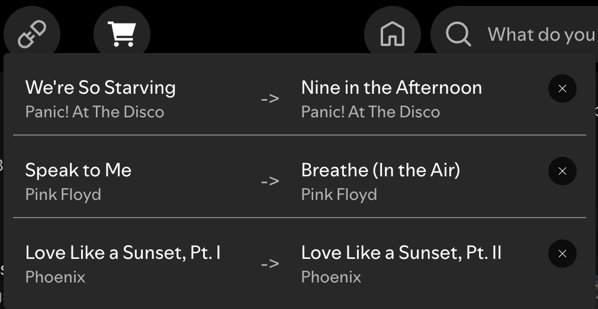

# Bound Tracks

Create bindings between songs so that when song X plays, song Y is automatically queued next.

For example, in this screenshot, _Nine in the Afternoon_ will be auto-queued if _We're So Starving_ is the current song.

## How to use

With a song playing, right-click another song and select the "Always play this after the current song" context menu item.  
This creates a binding between the songs.

To view all bindings, open the menu via the button in the top bar. Bindings can be removed from this menu.

## Acknowledgements

Some code was heavily borrowed from the [Bookmark](https://github.com/spicetify/cli/blob/main/Extensions/bookmark.js) extension by khankas.

## Bootstrapped with Spicetify Creator

-   https://github.com/spicetify/spicetify-creator
